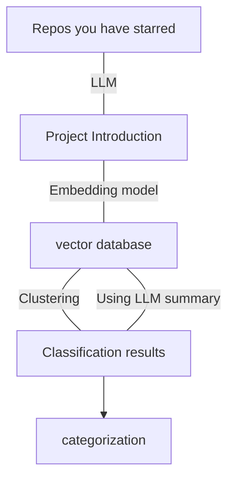

# GithubStarManager
AI-Powered GitHub Star Organizer: automated categorization keep your starred repositories perfectly curated! ✨
## Here’s how it works

```mermaid
flowchart TD
    A[Repos you have starred]-- LLM ---B[Project Introduction]
    B-- Embedding model ---C[vector database]
    C-- Clustering ---D[Classification results]
    D-- Using LLM summary ---C
    D-->E[categorization]
```
